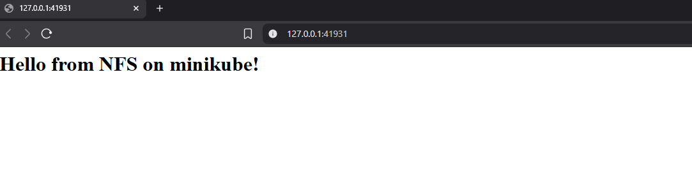
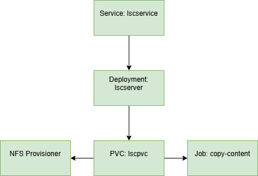

# Raport Lab6 - Adam Woźny

## Commands to run
Installing minikube and helm
```bash
sudo apt install gnome-terminal

curl -LO https://github.com/kubernetes/minikube/releases/latest/download/minikube-linux-amd64

sudo install minikube-linux-amd64 /usr/local/bin/minikube && rm minikube-linux-amd64

sudo snap install helm --classic

helm repo add nfs-ganesha-server-and-external-provisioner https://kubernetes-sigs.github.io/nfs-ganesha-server-and-external-provisioner/
```

starting minikube node
```bash
minikube start
```

installing nfs-provisioner
```bash
helm install lscnfs-provisioner charts/nfs-server-provisioner -f ./values.yaml
```

Creating all elements
```bash
kubectl apply -f pvc.yaml
kubectl apply -f deployment.yaml
kubectl apply -f job.yaml
kubectl apply -f service.yaml
```
Get url to app from minikube
```bash
minikube service lscservice --url
```

## Description of app


- Job saves index.html to shared volume
- Deployment mount the shared volume and run it

**Hyperlink to [repository](https://github.com/jakadam2/LSC)**

## Architecture



- lscservice - receives the user's request and forwards it to the correct internal application component (the web server).

- lscserver - runs a web server (nginx) that responds to requests. It gets the content from a shared storage volume.

- lscpvc - claim connects the web server to a storage space. It's a request for a volume where files can be saved and shared.

- NFS Provisioner - automatically provides the actual storage when the volume claim is created. It allows different parts of the app to access the same files.

- job (copy-content) - one-time task that creates a simple web page file and puts it into the shared storage. This is the page users see when they visit the app.